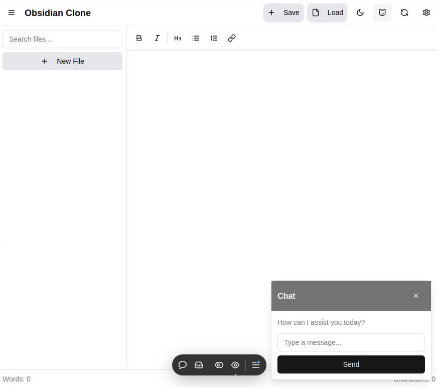

# Obsidian Clone 🎉

Welcome to **Obsidian Clone**! This is an initial step towards creating a fun and lightweight clone of the popular Obsidian note-taking app. Built with React, TypeScript, and [shadcn/ui](https://ui.shadcn.com/), it allows you to create, edit, and manage your notes effortlessly right in your browser.



## 🌟 Features

- **Rich Text Editing**: Format your notes with bold, italic, headings, lists, and more.
- **File Management**: Save, load, and delete notes stored in your browser's local storage.
- **Dynamic Sidebar**: View all your saved notes in the sidebar for quick access.
- **Dark Mode**: Toggle between light and dark themes to suit your preference.
- **Chat Assistant**: Need help? Chat with our friendly assistant!
- **Word & Character Count**: Keep track of your writing progress in real-time.

## 🚀 Getting Started

Follow these steps to get the app up and running on your local machine.

### Prerequisites

- **Node.js** and **npm** installed on your computer.

### Installation

1. **Clone the repository**

   ```bash
   git clone https://github.com/yourusername/obsidian-clone.git
   ```

2. **Navigate to the project directory**

   ```bash
   cd obsidian-clone
   ```

3. **Install dependencies**

   ```bash
   npm install
   ```

4. **Start the development server**

   ```bash
   npm run dev
   ```

5. **Open the app in your browser**

   Go to [http://localhost:3000](http://localhost:3000)

## 📝 Usage

- **Create a New Note**

  Click on the **New File** button in the sidebar to create a new note.

- **Save a Note**

  After editing, click on the **Save** button in the header to save your note to local storage.

- **Load a Note**

  Click on the **Load** button in the header to open a modal listing all your saved notes. Select a note to load it into the editor.

- **Delete a Note**

  In the sidebar or load modal, click the delete icon (a plus sign rotated 45 degrees) next to a note to delete it.

- **Toggle Dark Mode**

  Click on the sun/moon icon in the header to switch between light and dark themes.

- **Chat with Assistant**

  Click on the cat icon in the header to open the chat assistant for help or fun interactions.

## 🛠️ Technologies Used

- **React** and **Next.js**: For building the user interface.
- **TypeScript**: For type safety and better developer experience.
- **shadcn/ui**: For pre-built UI components styled with Tailwind CSS.
- **Tailwind CSS**: For styling and responsive design.
- **Local Storage**: To store and manage notes within the browser.

## 📷 Screenshot


## 📚 About shadcn/ui

This project utilizes [shadcn/ui](https://ui.shadcn.com/), a collection of reusable components built using Radix UI and Tailwind CSS. It provides accessible and customizable components that speed up development and maintain consistency across the app.

## 🚧 Future Steps

This is just the beginning! Future plans for the Obsidian Clone include:

- **Markdown Support**: Implementing markdown parsing and rendering.
- **Folder Structure**: Organizing notes within folders and subfolders.
- **Syncing**: Syncing notes across devices using a backend service.
- **Plugins**: Adding support for plugins to extend functionality.
- **Encryption**: Ensuring notes are securely stored and encrypted.

Stay tuned for more updates and features!

## 🤝 Contributing

Contributions are welcome! If you have ideas for improvements or find bugs, feel free to open an issue or submit a pull request.

1. Fork the project.
2. Create your feature branch: `git checkout -b feature/YourFeature`
3. Commit your changes: `git commit -m 'Add some feature'`
4. Push to the branch: `git push origin feature/YourFeature`
5. Open a pull request.

## 📄 License

This project is licensed under the MIT License - see the [LICENSE](LICENSE) file for details.

## 🙏 Acknowledgments

- Inspired by [Obsidian](https://obsidian.md/), the powerful knowledge base that works on top of a local folder of plain text files.
- Thanks to [shadcn](https://github.com/shadcn) for the amazing UI components.
- Appreciation to all the open-source contributors who made this project possible.

---

Have fun taking notes! If you like this project, don't forget to give it a ⭐ on GitHub.